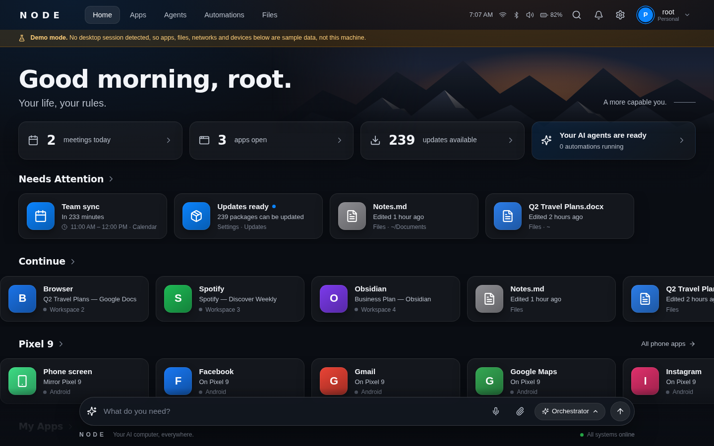
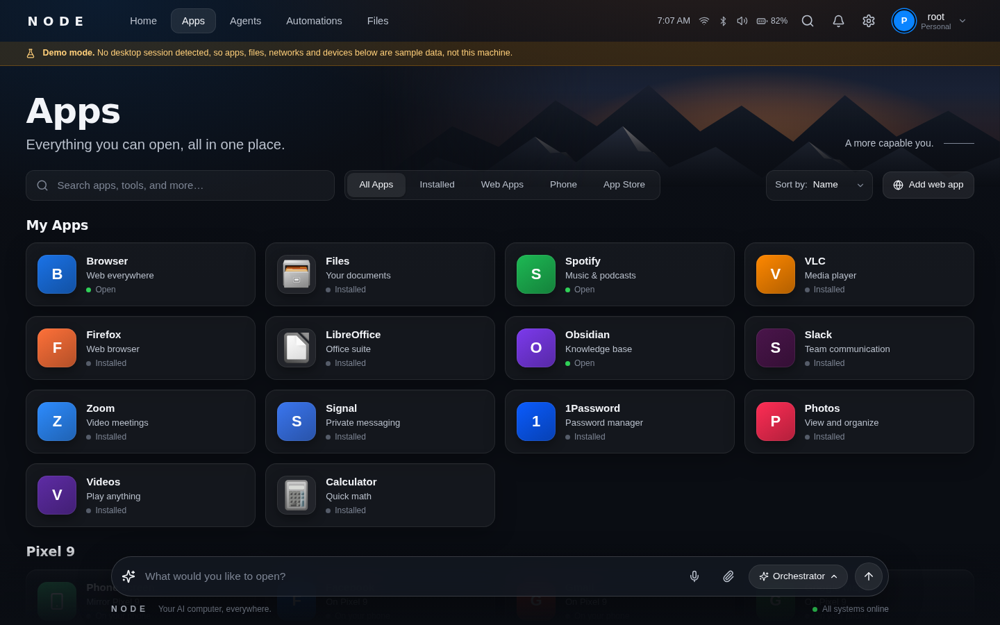
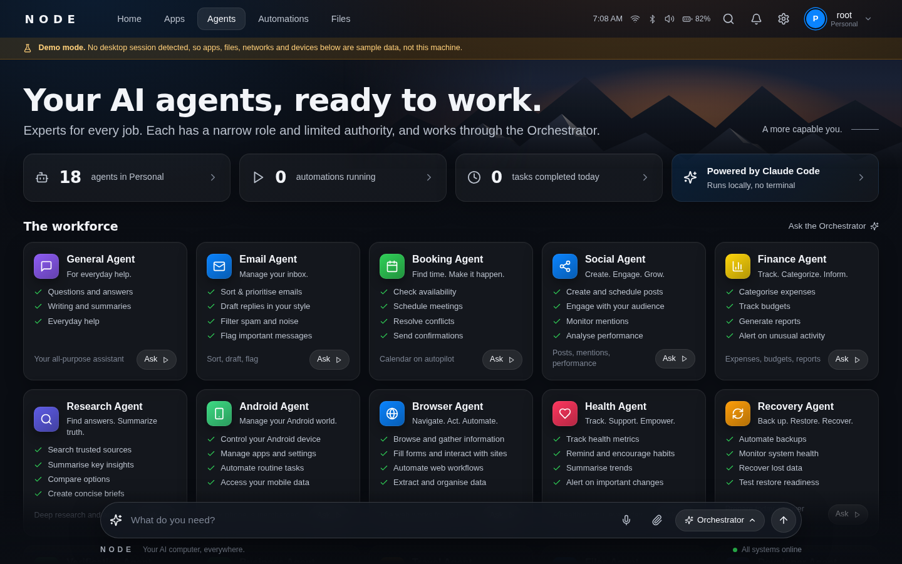
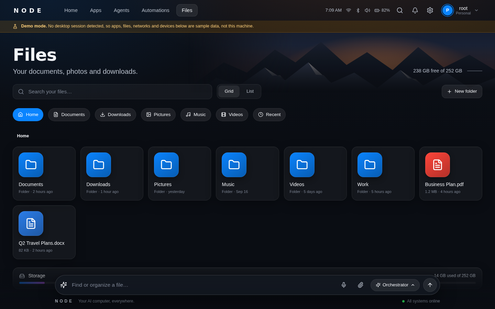
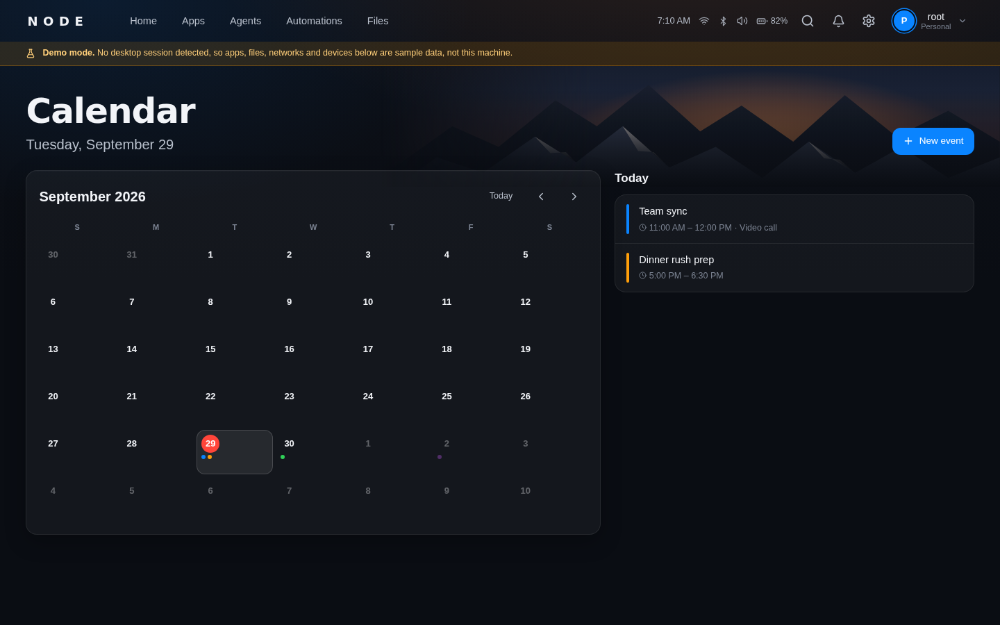
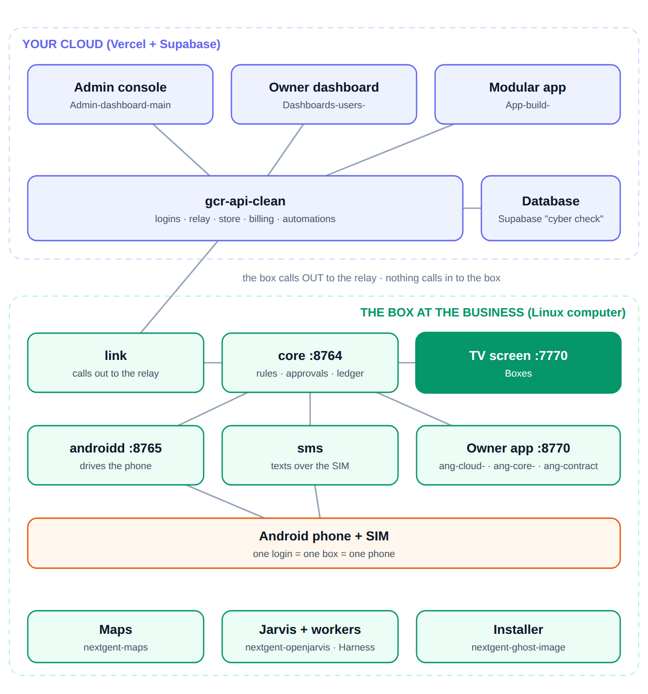

# NODE (Boxes)

A Linux computer the owner talks to. Everything on screen, nothing in a terminal.

This is **the TV screen of a Ghost box**: home screens, apps, agents, files, a
calendar, and an ask bar you can type or speak into. On a Ghost box it is
installed by `nextgent-ghost-image` as the `boxes` block and runs as `ghost-tv`
on `http://127.0.0.1:7770`. It replaces the older `Linux-` repo.



*Home. This capture is in demo mode (no desktop session was running), so the
apps, files and meetings are sample data. The banner says so on screen.*

| Apps | Agents |
| --- | --- |
|  |  |

| Files | Calendar |
| --- | --- |
|  |  |



<!-- branches:start -->
## Branches

*Read from GitHub on 2026-09-29. 6 branches.*

- **Default branch on GitHub:** `claude/linux-build-cleanup-dfpu0e`.
- **`claude/repo-code-analysis-y4n1k7`** is where this README and the audit fixes live. It contains every commit on `claude/linux-build-cleanup-dfpu0e` and more (this README, the audit fixes and the screenshots).
- **1 other branch holds commits that `claude/repo-code-analysis-y4n1k7` does not have.** The newest is `fix/ubuntu-node-support` (last commit 2026-09-28, 19 commits not in the work branch). Check it before assuming the work branch is the whole story.

| Branch | Last commit | Not in the work branch | Last commit message |
| --- | --- | --- | --- |
| `claude/repo-code-analysis-y4n1k7` (work branch) | 2026-09-29 | - | this README and the audit fixes |
| `fix/ubuntu-node-support` | 2026-09-28 | 19 | Show Ubuntu source in app store |
| `working-box` | 2026-09-22 | 0 | Capability loader, phone and notify capabilities, apt support, Tailscale |
| `claude/repo-docs-review-pt7b58` | 2026-09-21 | 0 | feat(daemon): the ask bar goes through the kernel |
| `claude/linux-build-cleanup-dfpu0e` (default) | 2026-09-15 | 0 | spec: the orchestration architecture |
| `main` | 2026-09-15 | 0 | spec: the orchestration architecture |

<!-- branches:end -->

## Anything that changes something goes through the kernel

The ask bar does not act on its own. `daemon/src/platform/decide.ts` is the one
door: a sentence goes to core (`NEXTGENT_CORE_URL`, default
`http://127.0.0.1:8764`) and is decided by the owner's rules there, ALLOW, ASK
(the owner is texted a code) or DENY. When core is not reachable the box still
answers questions that only read (hours, menu, bookings, availability, reviews,
events, which apps are installed), and
**refuses anything that would tap or change the phone or send a text**
(`daemon/src/platform/gate.ts`; read-only phone lookups such as `phone.screen`
still run). Every `adb` call that acts on a phone is pinned to the box's one
phone, `NEXTGENT_ANDROID_SERIAL` (listing calls, `adb devices -l` and
`adb track-devices`, are not).

**One exception to know about:** the ask bar posts to `/api/agents/ask`
(`daemon/src/modules/agents.ts`), which calls `decide()` first. A sentence that
neither core nor the box's declared phrases recognise is then handed to an
installed coding-agent CLI (`claude`, `codex`, `opencode`, `copilot`, `crush`,
`pi`) or to the local model. That fallback does not go through core.

## Run it

```bash
npm install
npm run dev          # daemon on :7770, shell on :5173
npm run dev:menu     # the menu app on :3000
npm run build        # daemon + shell, what the installer runs
npm test             # daemon tests (8)
```

With no desktop session the daemon starts in demo mode with sample data. On a
Ghost box, `ghost install boxes` builds it and starts `ghost-tv`.

## What is here

```
daemon/      the local HTTP server
  platform/  the client for the platform. the only thing that knows a URL.
  voice/     hearing, speaking, and the small model. all on this machine.
shell/       the TV interface — renders only, holds no business data
apps/menu/   the QR menu and its editor
box/         the appliance — image, boot config, systemd units, device agent,
             Hyprland rules (hypr/), a bench compose file for the voice stack (testbox/)
services/    an optional cloud path for inbound calls. not required.
spec/        design notes on the orchestration model (doors, cage, trace bus). not code.
module.manifest.json   what the Ghost installer reads: id boxes, kind screen, health check
```

## The three devices

**The phone** carries the SIM, the number, and the owner's own logins. It is
where the access lives, because it is where they signed in. It does the work.

**The box** does the talking and the thinking. Hearing, voice and the small
model all run here — not on the phone and not in a data centre. One voice for
the television, for a phone call, and for a text read aloud, so the business
sounds like one thing whichever door somebody came in.

**Their own phone** is the remote control.

## The three rules

**The box holds no database credential.** `daemon/src/platform/` is the only
thing that knows where the platform is (its base URL and token). Nothing in the
daemon, shell or menu app issues SQL. Request paths are written down in
`platform/capabilities.ts`, `platform/bookings.ts` and the `/api/business/*`
handlers in `daemon/src/index.ts`, all going through `platform/client.ts`.

**There is no model in the router.** `daemon/src/platform/router.ts` matches a
sentence against phrases each capability declared. A sentence either matches or
it returns UNROUTED — which is a correct and useful answer. It means: this is a
job for the shop. Solve it once, declare the phrase, every box gets it.

**The model never produces a figure.** When a sentence is escalated, a model may
choose which capability runs and phrase what came back. Every number in an
answer came out of the platform on that request.

## The path a sentence takes

```
  spoken at the TV, typed in the ask bar, or texted to the number
                          │
                          ▼
  router.ts        match a declared phrase. no model here.
                          │
              ┌───────────┴───────────┐
              ▼                       ▼
        a capability              UNROUTED
              │                   a real answer
              ▼
  capabilities.ts  run it — this is the only thing that fetches a value
              │
              ▼
  client.ts        one call to the platform. the platform owns the database.
              │
              ▼
  answer.ts        present what came back. invent nothing.
```

## Connecting a box

```bash
curl -X POST localhost:7770/api/platform/connect \
  -H 'Content-Type: application/json' \
  -d '{"baseUrl":"https://api.example.com","token":"…","slug":"flora-bama-yacht-club"}'
```

Written to `~/.config/nodeos/platform.json`, mode 0600. `NODEOS_API_URL`,
`NODEOS_API_TOKEN` and `NODEOS_SLUG` override it so a laptop can point at
staging without touching a box.

Unconnected is a normal state, not an error. The shell, files, calendar,
windows, audio and network all work on a box that has never been claimed.

## Voice

Everything lands in one place. `daemon/src/voice/pipeline.ts`:

```
      text ─┐
     audio ─┤                    ┌─ router: declared phrases, no model
       SMS ─┼──►  handle()  ────►┤
   webhook ─┘                    └─ small model, only when unrecognised
                                      │
                                      ▼
                            a capability runs for real
                                      │
                         ┌────────────┴────────────┐
                         ▼                         ▼
                  a list, on screen        one sentence, on the phone
```

There is exactly one place where a question becomes an answer, so the box
cannot say one thing in the room and another on the line.

A screen can carry a list. A call cannot — `2026-09-15 18:30 — Mike Halloran (6)`
is a row, not a sentence. `spoken()` in `platform/answer.ts` reads the same data
and says it the way a person would:

| Screen | Phone |
|---|---|
| `Sunday: 11:00 to 22:00` / `Monday: closed` / `Friday: 11:00 to 02:00` | *"Sunday, 11:00 to 22:00 and Friday, 11:00 to 02:00. Closed Monday."* |
| `2 bookings today.` / `  18:30 — Mike Halloran (6)` / `  20:00 — Dana Reyes (2)` | *"2 bookings today, starting at 6:30 pm and finishing at 8 pm."* |

Both are the same facts, fetched once. Neither invents one.

### What it runs on

| Layer | Default | Where |
|---|---|---|
| Hearing | whisper.cpp, `small.en` | on the box |
| Voice | Piper, falls back to espeak-ng | on the box |
| Model | any OpenAI-compatible endpoint (`NODEOS_LLM_URL`, model `NODEOS_LLM_MODEL`); default `http://127.0.0.1:8080/v1`, model `fast` | on the box. The bench compose in `box/testbox/` uses Ollama on `:11434` |

`GET /api/voice` reports which hearing engine and voice engine this machine
has (`none` when missing), whether the model endpoint answers, and the counts
below. A box with no voice still answers in writing.

### The small model's job

It is not answering. It reads a sentence the router did not recognise and picks
which capability would answer it. The capability then runs for real, and the
model writes one line from what came back. It is choosing and phrasing, never
knowing — which is why a small model on a mini-PC is enough.

### The number that matters

`GET /api/voice` returns the share of sentences that came back UNROUTED. When
it climbs, the answer is to declare more phrases, not to buy a bigger model.
Watching it fall is the whole business.

### Getting a call into it

The box answers on `POST /api/voice/heard` (JSON `{wav, channel?}` with the
16kHz mono WAV base64-encoded; the reply is JSON with the turn and the spoken
answer as a base64 WAV) or `POST /api/voice/text` (`{text, channel?}`) if
something upstream already transcribed. `/api/voice/sms` takes an inbound text,
`/api/voice/say` turns a sentence into speech, `/api/voice/aloud` speaks on the
box's own speakers.

**One constraint worth knowing before wiring a phone up:** Android does not let
an ordinary app read the audio of a normal cellular call. There is no ADB route
to it. Three things do work:

| Route | How |
|---|---|
| **SIP / VoIP app on the phone** | The number is carried over data. The app has the audio because the call is its own. Closest to "the phone answers it". |
| **Carrier forwarding to a SIP trunk** | The SIM keeps the number; calls forward to something that can hand the box audio. |
| **Twilio or similar** | A webhook posts audio or a transcript to the box. Nothing in this repo does that yet: `services/voice/` is a separate cloud-side Twilio-to-OpenAI-Realtime service that answers the call itself and never calls the box's `/api/voice/*`. |

The middle one keeps the owner's number on the owner's SIM and still gives the
box the audio. It is the one to try first.

## Adding a capability

One new file in `daemon/src/platform/capabilities/` (`box.hello.ts` is the
template). `capabilities.ts` says nothing new should be added to its built-in
array; files in the folder are loaded at startup, and a broken file or a
duplicate key is skipped with a warning.

```ts
import type { Capability } from "../capabilities.js";
import { platform, qs } from "../client.js";
import { platformConfig } from "../config.js";

export default {
  key: "hours.raw",
  summary: "The opening hours exactly as the platform holds them.",
  phrases: ["raw hours", "hours as stored"],
  readOnly: true,
  run: async () => {
    const { slug } = await platformConfig();
    return platform.get(`/api/dashboard/hours${qs({ slug })}`);
  },
} satisfies Capability;
```

Then a presenter in `answer.ts` if the default line is not good enough. Rebuild
and restart the daemon. The shell does not change and the router does not
change.

## What else the daemon does

Everything below is in `daemon/src/index.ts` and `daemon/src/modules/`; it is the
inherited `Linux-` desktop layer and is not part of the business path above.

- Apps from three providers: `.desktop` files, web apps run in their own browser
  window, and apps on a phone plugged in over USB (adb, mirrored with scrcpy).
- An app store over Flathub (flatpak) and pacman, with an apt-based update check.
- Files (home folder and mounted media only), a calendar (local events plus the
  platform's bookings, events and specials), notifications, Hyprland windows.
- Settings: Wi-Fi, Bluetooth, sound, brightness, night light, power, themes and
  backgrounds (Omarchy tools when present).
- "Worlds" (per-person or per-context profiles with their own apps, agents, look
  and optional PIN), three home looks (`dashboard`, `living`, `cinema`),
  scheduled automations, 19 agent personas, and weather from Open-Meteo.
- Server-sent events at `/api/events`; extra capabilities are loaded from
  `daemon/src/platform/capabilities/` (compiled `.js`) at startup. A route-module
  loader exists (`daemon/src/routes/registry.ts`) but `index.ts` does not call it.
- Environment variables not named above: `NODEOS_HOST` (bind address, default
  `127.0.0.1`), `NODEOS_DEMO=1` (force demo mode), `NODEOS_DATA_DIR`,
  `NODEOS_SHELL_DIST`, `NODEOS_STT_MODEL`, `NODEOS_TTS_VOICE`, `NODEOS_TTS_CMD`,
  `NODEOS_TTS_URL`, `NODEOS_OWNER_NUMBER` (who `notify.text` texts),
  `NODE_KERNEL_URL` / `NODE_KERNEL_TOKEN` (override `NEXTGENT_CORE_*`).

## Where the pieces came from

| Here | Taken from |
|---|---|
| `daemon/`, `shell/` | `Linux-` |
| `daemon/src/platform/` | new |
| `apps/menu/` | `menu-builder`, with its Supabase key removed |
| `services/voice/` | `ghost-ai/backend-api` |
| `box/agent/` | `cybercheck-node/runtime/agent` |
| `box/image/`, `box/boot/` | `cybercheck-node` |

## What is not done

- `services/voice/` — the cloud call path — still writes to the database
  directly. It holds a Supabase key (`config/supabase.js`) and has 66
  `.from('…')` query sites across 10 files (counted with grep). Its own README
  lists only 4 files and 24 sites, and has no `package.json` here. The on-box
  path in `daemon/src/voice/` does not have this problem; it goes through
  `platform/`.
- `apps/menu/` still calls daemon routes that do not exist (`POST
  /api/business/upload`, `POST /api/business/menu`), and its
  `/admin/qr-menus` page posts to `/api/ai/extract-menu`, `/api/menus`,
  `/api/items` and `/api/specials`, which the app does not define. Its
  `.env.example` still lists Supabase variables that nothing reads.
- Nothing has been tested against a real handset yet. The voice pipeline has
  been exercised end to end with text and with a stub platform.
- `box/image/` is still the Raspberry Pi build (docker, a udev rule, a screen
  mirror script). **Do not run it on a Ghost box**: there `androidd` owns the
  phone and `nextgent-ghost-image` owns the services, and the Pi image would
  start a second adb owner. The target is x86, 16GB, with rollback, which the
  installer provides.
- Nothing fans out yet. The daemon can add or delete a menu item and delete a
  special on the platform (`/api/business/menu/item`,
  `/api/business/specials/:id`), but canonical facts, fan-out and receipts —
  the "say it once, it lands everywhere" half — are not in this repo. The design is
  finished and sitting in `cybercheck-orchestrator/db/*.sql` and
  `src/kernel/channels.js`; it needs one decision before it moves.
